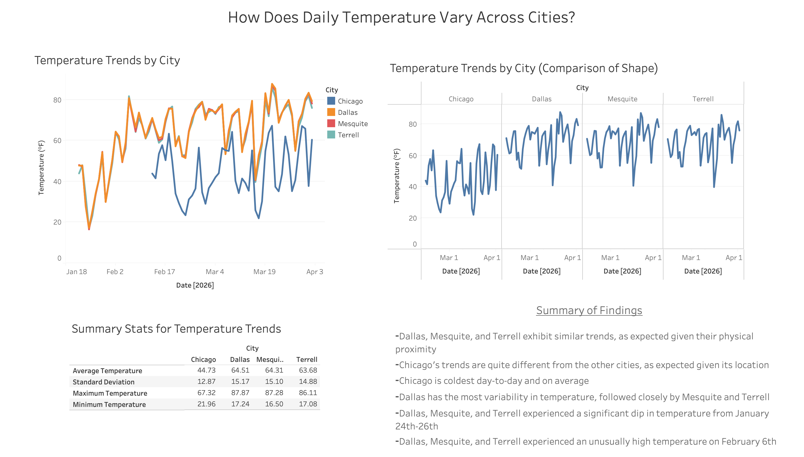
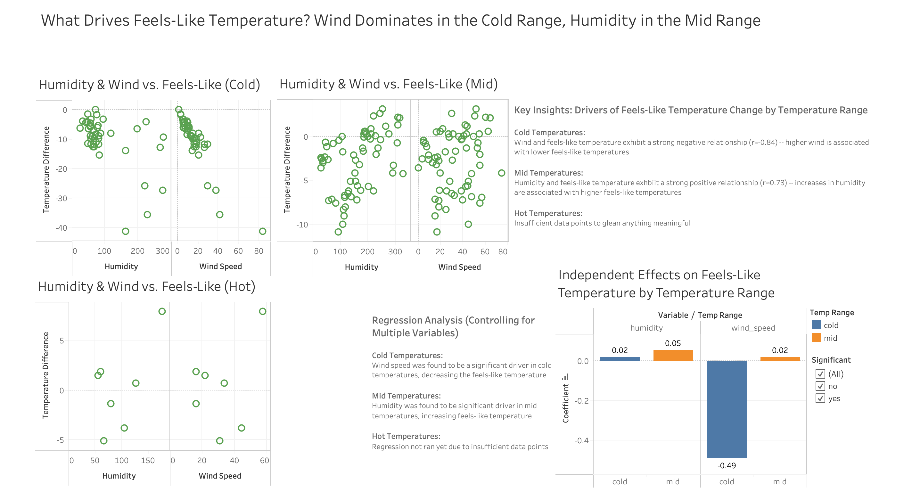
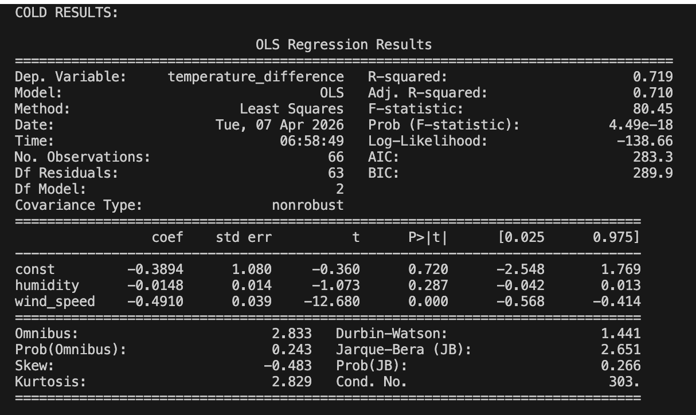
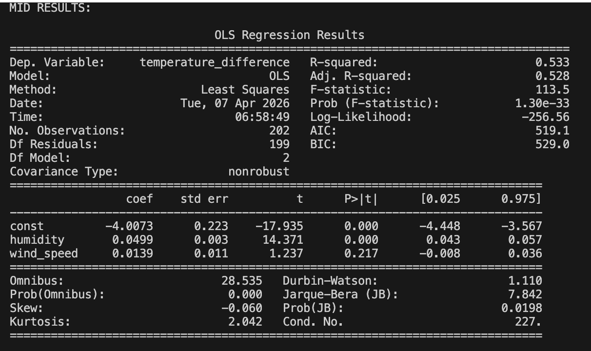

# Weather Data Project

## Description
This project builds a data pipeline that collects, stores, transforms, and analyzes weather data using the OpenWeather API.

Said pipeline integrates Python, MySQL, pandas, and Tableau to transform raw API data into meaningful insights.

**Workflow:**  
OpenWeather API → Python → MySQL → pandas → Tableau

---

## Current Status
- Data collection, cleaning, and analysis scripts are fully functional  
- Data is collected daily at 12:00 PM  

---

## Project Structure
- `scripts/` — data collection, transformation, analysis, and database logic  
- `data/` — CSV files used as Tableau data sources
- `screenshots/` — screenshots of Tableau dashboards and regression output
- `requirements.txt` — environment dependencies for reproducibility  

---

## Design Decisions

- **Separation of concerns:**  
  API handling, transformation, analysis, and database logic are separated into distinct files for clarity and scalability  

- **Daily data collection:**  
  Data is collected once per day at a consistent time to ensure comparability across all observations  

- **Single-table schema:**  
  Weather data for all cities is stored in a single table, since each record shares the same structure  

- **Composite primary key (`city`, `date`):**  
  Ensures uniqueness across multiple cities with overlapping dates  

- **Safe reruns with `ON DUPLICATE KEY UPDATE`:**  
  Allows scripts to be rerun without introducing duplicate data  

- **Segmenting analysis based on temperature range:**

  Initially, both temperature trends and feels-like analysis were separated by city; I decided it would be more valuable to analyze feels-like factors based on temperature ranges (cold, mid, hot), so as to prevent dampening the effects of wind/humidity in the non-segmented version

---

## Analysis Approach

Python + pandas were used to create dataframes and CSVs for analysis; these CSVs have all been imported into Tableau.

For feels-like factors, initial exploratory analysis was performed in Tableau using scatterplots and correlation to identify potential relationships.

To quantify these relationships more rigorously, a **multiple linear regression model** was ran in Python via `statsmodels`.

The model:

`temperature_difference ~ humidity + wind_speed`

Where:
- `temperature_difference = feels_like_temperature - actual_temperature`

Multiple regression was chosen to isolate the independent effects of humidity and wind speed while controlling for potential overlap between them.

---

## Key Findings

Analysis revealed that the drivers of perceived temperature vary greatly by temperature range:

- **Cold temperatures (<50°F):**  
  Wind speed is the dominant factor, with a strong negative relationship *(r ≈ -0.84)*  
  Higher wind speed is strongly associated with decreased perceived temperatures 

- **Mid-range temperatures (50–79°F):**  
  Humidity is the dominant factor, with a strong positive relationship *(r ≈ 0.73)*  
  Higher humidity is associated with higher perceived temperature  

- **Hot temperatures (80°F+):**  
  Insufficient data to glean reliable conclusions  

Regression analysis confirmed these findings:
- Wind speed is statistically significant in cold conditions  
- Humidity is statistically significant in mid-range conditions  
- Other relationships were not statistically significant  

---

## Tableau Dashboards

## Regression Results

---

## Future Improvements
- Expand dataset to strengthen statistical reliability
- Increase data collection frequency (morning vs evening comparisons)
- Further analysis as dataset grows
- Regression analysis for the hot temperature range once a sufficient number of data points are collected
- Explore additional feels-like variables (e.g., sunlight, cloud cover)
- Additional error handling 
